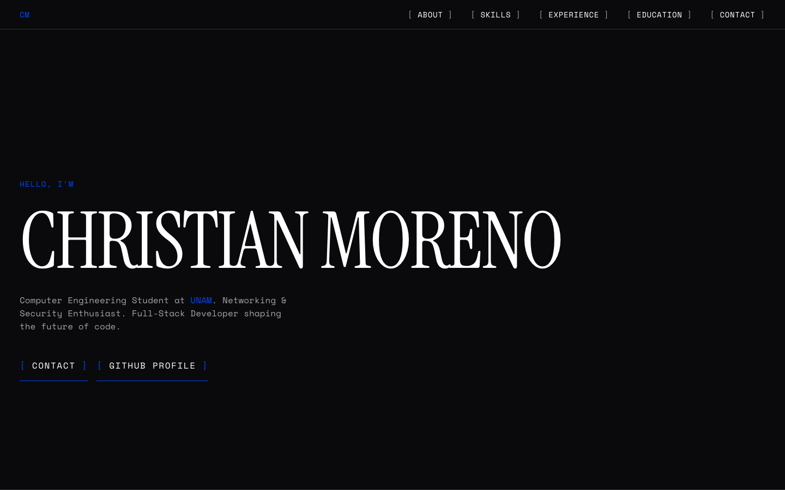
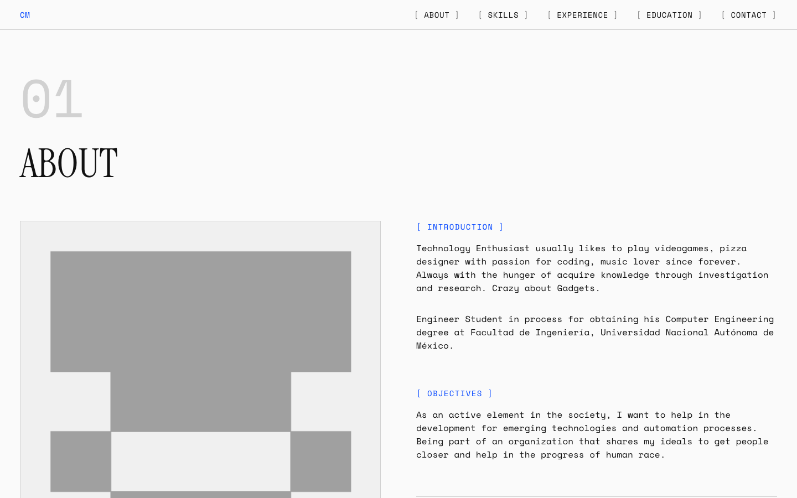
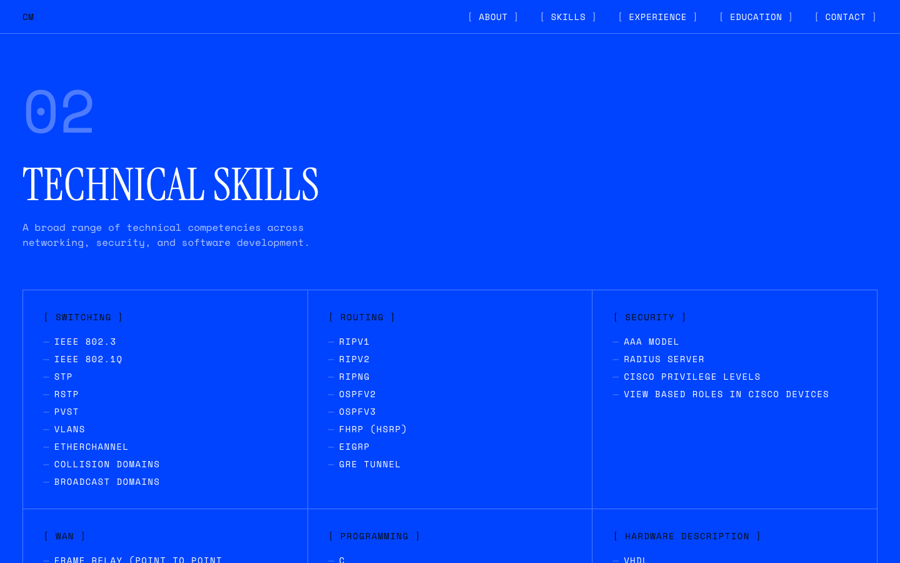

# cmoreno.org Portfolio

Portafolio personal construido con Go, SQLite, HTMX y Alpine.js. El frontend conserva una estética editorial tech-brutalista y el backend está preparado para ejecutarse en Coolify detrás de Traefik.

## Arquitectura

La aplicación utiliza un servidor `net/http` sin framework:

- `main.go`: arranque, rutas, templates embebidos, graceful shutdown y endpoints operativos.
- `database.go`: conexión SQLite, migraciones y acceso a datos.
- `middleware.go`: recovery, request ID, logs, headers de seguridad, compresión y caché.
- `config.go`: configuración mediante variables de entorno.
- `internal/buildinfo`: versión, commit y fecha de compilación inyectables mediante `-ldflags`.
- `migrations/`: migraciones SQL embebidas y versionadas.
- `templates/`: página principal y partials HTMX.
- `static/`: CSS e imágenes embebidas en el binario.

El contenedor es stateless. El único estado persistente vive en `/data`.

## Stack

- Go `1.23.x`
- SQLite con `github.com/mattn/go-sqlite3`
- HTMX
- Alpine.js
- Prometheus client para `/metrics`
- Docker BuildKit

No se utilizan PostgreSQL, React, Vue ni Next.js.

## Configuración

| Variable | Default | Descripción |
|---|---|---|
| `PORT` | `8080` | Puerto HTTP de escucha |
| `DATABASE_PATH` | `/data/site.db` | Ruta de SQLite |
| `APP_ENV` | `development` | `development` usa logs legibles; `production` usa JSON |
| `LOG_LEVEL` | `info` | `debug`, `info`, `warn` o `error` |

Consulta `.env.example` para una configuración inicial.

## Desarrollo local

### Ejecución nativa

```bash
make run
```

El comando usa `./data/site.db` para evitar escribir en `/data` durante el desarrollo nativo de macOS/Linux.

### Docker Compose

```bash
mkdir -p data
```

La aplicación queda disponible en `http://localhost:8080`. En Linux, si el bind mount no permite escribir a UID `10001`, ajusta el propietario del directorio:

```bash
sudo chown -R 10001:10001 data
```

## Comandos

```bash
make run         # servidor local
make build       # binario con build info
make test        # tests con race detector
make lint        # golangci-lint local
make lint-docker # golangci-lint v1.62.2 mediante Docker (sin instalación global)
make vuln        # govulncheck
make docker      # build BuildKit con imagen local
make clean       # elimina únicamente binarios locales
```

También se recomienda ejecutar:

```bash
go mod tidy
go test ./...
go vet ./...
```

## Docker

El Dockerfile utiliza:

- BuildKit cache mounts para módulos y compilación.
- Copias selectivas después de descargar dependencias.
- Build multi-stage.
- CGO habilitado únicamente en la etapa builder por `go-sqlite3`.
- `debian:bookworm-slim` como runtime compatible con SQLite CGO.
- Usuario no privilegiado `appuser` con UID `10001`.
- `HEALTHCHECK` contra `/health`.
- Labels OCI con versión y revisión.

Build manual:

```bash
docker buildx build --load \
  --build-arg VERSION="dev" \
  --build-arg COMMIT="none" \
  --build-arg BUILD_DATE="unknown" \
  -t portfolio:local .
```

El puerto declarado `EXPOSE 8080` es metadata. El proceso siempre escucha en el valor de `PORT`.

## Endpoints operativos

- `GET /health`: liveness; devuelve `200 OK` si el proceso está activo.
- `GET /ready`: valida SQLite y el directorio de datos.
- `GET /version`: devuelve versión, commit y fecha de compilación.
- `GET /metrics`: expone métricas compatibles con Prometheus.

## Caché y seguridad

Los assets estáticos (`css`, `js`, `svg`, imágenes y fuentes) usan caché inmutable y ETags calculados sobre su contenido. HTML, partials HTMX y endpoints dinámicos usan:

```http
Cache-Control: no-cache
```

HTMX, Alpine.js, Phosphor Icons y las fuentes están vendorizados en `static/` y embebidos en el binario; no se carga ningún recurso externo. El servidor añade `X-Content-Type-Options`, `X-Frame-Options`, `Referrer-Policy`, `Permissions-Policy` y una `Content-Security-Policy` con `default-src 'self'` y `script-src 'self' 'unsafe-eval'`. `unsafe-eval` sigue siendo necesario por el build estándar de Alpine.js; su eliminación requiere migrar a la build CSP-compatible.

Las sesiones se guardan en SQLite únicamente como hash SHA-256 del token; el token en claro solo existe en una cookie `HttpOnly`, `SameSite=Lax` y `Secure` en producción. Todas las mutaciones administrativas requieren `Origin`/`Referer` válido y el header `X-CSRF-Token` (que HTMX añade automáticamente desde la cookie `csrf_token`). Login y contacto tienen rate limiting en memoria por IP directa.

## SQLite y migraciones

La aplicación crea automáticamente el directorio de la base de datos con permisos `0700` y el archivo con `0600`, y aplica las migraciones embebidas en orden. SQLite usa:

- `journal_mode=WAL`
- `synchronous=NORMAL`
- `foreign_keys=ON`
- `busy_timeout=5000`
- un único connection slot para evitar conflictos de escritura en `database/sql`

No se debe editar una migración ya aplicada. Añade una nueva migración numerada. La migración `005_security_hardening.sql` invalida las sesiones existentes: tras actualizar a esta versión hay que iniciar sesión de nuevo.

## Administrador

No existe ninguna credencial por defecto. El administrador se crea o actualiza con:

```bash
go run . admin set-password --username admin
```

El comando usa `DATABASE_PATH` (default `/data/site.db`), solicita la contraseña de forma oculta, la confirma, guarda un hash Argon2id y revoca todas las sesiones activas. La contraseña debe tener al menos 12 caracteres y como máximo 128 bytes. Para entornos sin terminal interactiva:

```bash
./portfolio admin set-password --username admin --password-stdin < /ruta/segura/password.txt
```

Con `APP_ENV=production` el servicio no arranca si no existe un administrador con hash Argon2id; en desarrollo solo registra una advertencia. Los hashes SHA-256 de versiones anteriores dejan de ser válidos y deben rotarse con este comando.

## Despliegue en Coolify

1. Crear un recurso basado en Dockerfile.
2. Configurar el dominio de Traefik para el servicio.
3. Mantener `PORT` con el valor que Coolify exponga al contenedor.
4. Crear un volumen persistente montado exactamente en `/data`.
5. Definir `APP_ENV=production` y `LOG_LEVEL=info`.
6. Antes del primer arranque, provisionar el administrador contra el mismo volumen (los argumentos tras la imagen son el subcomando del binario):
   ```bash
   docker run --rm -it -v <volumen>:/data portfolio:latest admin set-password --username admin
   ```
7. Configurar el healthcheck del recurso usando `/health` o dejar que Coolify utilice el `HEALTHCHECK` de la imagen.

La aplicación no asume HTTPS ni realiza redirects automáticos. Los headers `X-Forwarded-*` solo se registran como información no confiable; el rate limiting usa la dirección directa (`RemoteAddr`), por lo que debe aplicarse en Traefik si se necesita limitar por IP real.

### Endurecimiento en Traefik

Aplicar HSTS en el proxy y proteger `/metrics` con allowlist o autenticación básica, sin tocar la aplicación:

```yaml
# Ejemplo de middlewares de Traefik
- "traefik.http.middlewares.portfolio-headers.headers.stsSeconds=31536000"
- "traefik.http.middlewares.portfolio-headers.headers.stsIncludeSubdomains=true"
- "traefik.http.middlewares.metrics-allow.ipallowlist.sourcerange=10.0.0.0/8"
```

## Backups

`/data` es el único directorio que necesita respaldo. Incluye `site.db` y, mientras SQLite está usando WAL, sus archivos auxiliares `site.db-wal` y `site.db-shm`.

Para un backup consistente, detén temporalmente el servicio o utiliza una copia SQLite online. No respaldes el contenedor completo ni los assets embebidos.

## Actualizaciones

1. Respaldar `/data`.
2. Desplegar el nuevo commit en Coolify.
3. Mantener el mismo volumen montado en `/data`.
4. Verificar `/health`, `/ready` y `/version`.
5. Revisar los logs estructurados del contenedor.

Las migraciones pendientes se aplican automáticamente durante el arranque.

## Privacidad y logs

Los logs estructurados registran método, ruta, estado, duración, `RemoteAddr`, los headers `X-Forwarded-*` (no confiables, solo informativos) y un user-agent truncado a 256 caracteres. No se registran contraseñas, tokens de sesión ni tokens CSRF.

- Define una retención corta para logs (por ejemplo, 7-30 días) en el colector o en Coolify.
- Los mensajes de contacto viven únicamente en `/data/site.db`; elimínalos desde el panel cuando dejen de ser necesarios.
- No expongas `/metrics` ni los logs a redes públicas.

## Troubleshooting

### `database is locked`

Verifica que solo exista una instancia escribiendo en el mismo volumen SQLite, que `/data` sea persistente y que WAL esté habilitado.

### `/ready` devuelve `503`

Revisa permisos del volumen, existencia de `/data` y el valor de `DATABASE_PATH`.

### El arranque falla con `secure data directory` o `secure database file`

El proceso aplica permisos `0700` a `/data` y `0600` a la base de datos, por lo que necesita ser propietario del volumen. En Linux:

```bash
sudo chown -R 10001:10001 data
```

### El contenedor no pasa el healthcheck

Confirma que `PORT` coincida con el puerto interno usado por Coolify y que `/health` responda dentro de cinco segundos.

### Cambios HTML no aparecen

El HTML usa `Cache-Control: no-cache`. Verifica el despliegue y revisa `/version`; los assets tienen ETags basados en contenido.

### `403` al iniciar sesión o ejecutar acciones de administración

`Origin`/`Referer` deben coincidir con el `Host` recibido. Si Traefik reescribe el `Host` hacia un nombre interno, configura el servicio para preservar el host original del cliente.

## Previews






